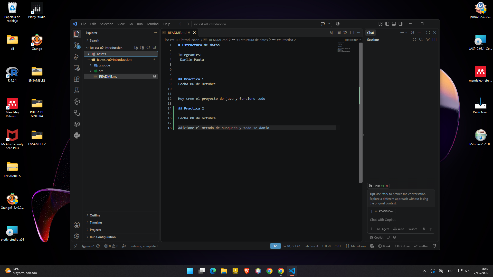

# Estructura de datos 

Integrantes: 
-Darlin Pauta

## Practica 1
Fecha 06 de Octubre 

Hoy cree el proyecto de java y funciono todo

## Practica 2

Fecha 08 de octubre 

Adicione el metodo de busqueda y todo se danio

